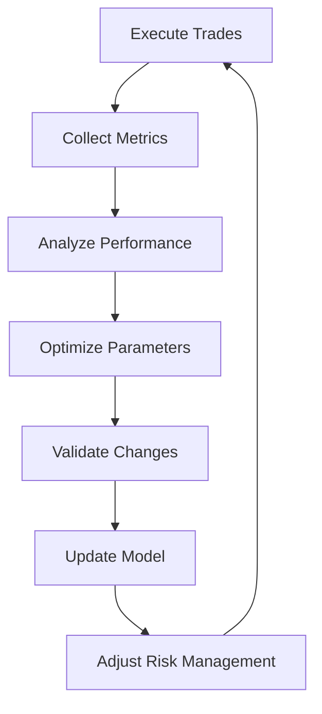

# High Frequency Trading Strategy with RSI and Self-Learning

## Overview
This specification outlines a high-frequency trading strategy that utilizes the Relative Strength Index (RSI) indicator combined with an evolving self-learning mechanism for continuous improvement.

## Strategy Components

### 1. RSI Analysis
- Calculate RSI using high-frequency data (1-minute intervals)
- Primary RSI parameters:
  - Period: 14 (dynamically adjusted by learning mechanism)
  - Overbought threshold: 70 (adaptive)
  - Oversold threshold: 30 (adaptive)
  - Signal smoothing using exponential moving average (EMA)

### 2. Trading Logic
- Entry Conditions:
  - Long position when RSI crosses above oversold threshold
  - Short position when RSI crosses below overbought threshold
- Exit Conditions:
  - Take profit at predefined target (adjusted by learning mechanism)
  - Stop loss at maximum drawdown threshold (adaptive)
  - Time-based exit for stale positions

### 3. Self-Learning Mechanism

#### A. Performance Metrics Collection
```
metrics = {
    'win_rate': percentage of profitable trades,
    'profit_factor': gross_profits / gross_losses,
    'sharpe_ratio': risk_adjusted_returns,
    'max_drawdown': largest peak-to-trough decline,
    'avg_trade_duration': average holding period
}
```

#### B. Parameter Optimization Loop
1. Initial Parameters
```
parameters = {
    'rsi_period': 14,
    'overbought_threshold': 70,
    'oversold_threshold': 30,
    'profit_target': 0.5%,
    'stop_loss': 0.3%,
    'position_size': 1%
}
```

2. Evolution Process
```
while True:
    # Trading Cycle
    execute_trades(parameters)
    collect_metrics()
    
    # Analysis
    performance = analyze_results()
    
    # Optimization
    if performance.requires_adjustment():
        parameters = optimize_parameters()
        validate_changes()
    
    # Learning
    update_model(performance_data)
    adjust_risk_management()
```

### 4. Risk Management

#### A. Position Sizing
- Dynamic position sizing based on:
  - Account volatility
  - Market conditions
  - Recent performance
  - Risk tolerance level

#### B. Risk Controls
- Maximum position size limits
- Daily loss limits
- Exposure limits per asset
- Correlation-based portfolio constraints

### 5. Market Analysis Integration

#### A. Real-time Data Processing
```
market_data = {
    'price_data': 1min_candles,
    'volume_data': tick_by_tick_volume,
    'order_book': L2_data,
    'market_depth': bid_ask_spreads
}
```

#### B. Market State Classification
- Identify market regimes:
  - Trending
  - Range-bound
  - Volatile
  - Calm

### 6. Self-Improvement Loop



#### A. Continuous Learning Process
1. Data Collection
   - Trade outcomes
   - Market conditions
   - Parameter effectiveness
   - Risk metrics

2. Analysis Phase
   - Pattern recognition
   - Anomaly detection
   - Performance attribution
   - Risk factor analysis

3. Optimization Phase
   - Parameter tuning
   - Strategy adaptation
   - Risk adjustment
   - Performance enhancement

4. Validation Phase
   - Backtesting
   - Forward testing
   - Out-of-sample validation
   - Stress testing

## Implementation Guidelines

### 1. System Architecture
```bash
/hft_rsi_strategy
    /data_collection
        - market_data.sh
        - metrics_collector.sh
    /analysis
        - rsi_calculator.sh
        - pattern_analyzer.sh
    /execution
        - trade_executor.sh
        - position_manager.sh
    /optimization
        - parameter_optimizer.sh
        - risk_adjuster.sh
    /validation
        - backtest.sh
        - forward_test.sh
```

### 2. Execution Flow
```bash
#!/bin/bash

# Main execution loop
while true; do
    # 1. Data Collection
    ./collect_market_data.sh
    
    # 2. Analysis
    ./calculate_rsi.sh
    ./analyze_patterns.sh
    
    # 3. Decision Making
    ./generate_signals.sh
    
    # 4. Execution
    ./execute_trades.sh
    
    # 5. Monitoring
    ./collect_metrics.sh
    
    # 6. Optimization
    ./optimize_parameters.sh
    
    # 7. Validation
    ./validate_changes.sh
    
    # 8. Learning
    ./update_model.sh
    
    sleep 1  # 1-second interval for HFT
done
```

### 3. Performance Monitoring
- Real-time metrics dashboard
- Alert system for:
  - Abnormal behavior
  - Risk threshold breaches
  - Performance degradation
  - System health issues

### 4. Failsafes
- Emergency shutdown procedures
- Position liquidation protocols
- Risk limit breaches
- System health monitors
- Market condition checks

## Success Metrics

### 1. Trading Performance
- Sharpe Ratio > 2.0
- Win Rate > 55%
- Profit Factor > 1.5
- Maximum Drawdown < 10%

### 2. System Performance
- Execution latency < 100ms
- Decision making time < 50ms
- Update cycle time < 1s
- System uptime > 99.9%

### 3. Learning Effectiveness
- Parameter convergence rate
- Adaptation speed to market changes
- Prediction accuracy improvement
- Risk management effectiveness

## Next Steps

1. Implementation Phase
   - Set up development environment
   - Implement core components
   - Develop testing framework
   - Create monitoring system

2. Testing Phase
   - Unit testing
   - Integration testing
   - System testing
   - Performance testing

3. Deployment Phase
   - Paper trading
   - Small-scale live testing
   - Gradual scaling
   - Full deployment

4. Monitoring Phase
   - Performance tracking
   - Risk monitoring
   - System health checks
   - Continuous improvement
