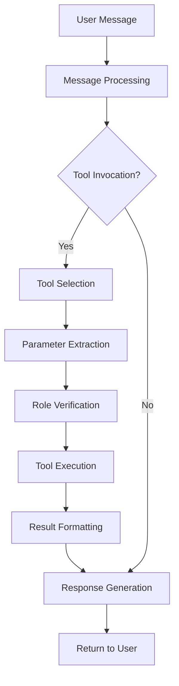

# Agent Framework and Tools

SynthLang Proxy includes a powerful agent framework that enables dynamic, tool-enhanced capabilities, allowing your applications to perform complex actions and integrate with external services without any modifications to the client application.

## Overview

The agent framework transforms static LLM applications into dynamic, agentic systems by providing:

- **Tool Registry**: A centralized registry of available tools
- **Tool Execution**: Seamless execution of tools with appropriate parameters
- **Keyword Detection**: Automatic tool invocation based on message patterns
- **Hashtag Directives**: Explicit tool invocation via hashtags
- **Role-Based Access**: Fine-grained control over tool access



## Built-in Tools

SynthLang Proxy comes with several built-in tools ready to use:

### Web Search

Uses search capabilities to retrieve information from the web.

```
#tool_search What are the latest developments in quantum computing?
```

**Parameters**:
- `query`: The search query

**Response**: Search results with relevant information

**Required Role**: basic

### Weather

Gets weather information for a specified location.

```
#tool_weather London
```

**Parameters**:
- `location`: City or location

**Response**: Current weather conditions and forecast

**Required Role**: basic

### Calculator

Performs mathematical calculations and conversions.

```
#tool_calculate 15% of 85.50 + 25
```

**Parameters**:
- `expression`: Mathematical expression to evaluate

**Response**: Calculated result with steps

**Required Role**: basic

### File Search

Searches through files using semantic similarity.

```
#tool_file_search authentication in codebase
```

**Parameters**:
- `query`: Search query
- `path` (optional): Directory path to search in
- `file_pattern` (optional): File pattern to match (*.py, *.js, etc.)

**Response**: Matching file excerpts with context

**Required Role**: premium

### Data Analysis

Orchestrates a complete data analysis workflow.

```
#tool_analyze_data sales_data.csv with forecast for Q3
```

**Parameters**:
- `dataset`: Dataset to analyze
- `task` (optional): Analysis task to perform
- `format` (optional): Output format (table, chart, etc.)

**Response**: Analysis results and visualizations

**Required Role**: premium

### Code Generator

Generates code with explanations for various programming tasks.

```
#tool_generate_code Create a React component for a login form
```

**Parameters**:
- `task`: Code generation task
- `language` (optional): Programming language
- `framework` (optional): Framework to use

**Response**: Generated code with explanations

**Required Role**: basic

### Document Summarizer

Summarizes documents or web pages.

```
#tool_summarize https://example.com/article
```

**Parameters**:
- `url_or_text`: URL or text to summarize
- `length` (optional): Desired summary length

**Response**: Concise summary of the content

**Required Role**: basic

## Tool Invocation Methods

There are several ways to invoke tools in SynthLang Proxy:

### 1. Hashtag Directives

The most explicit way to invoke tools is using hashtag directives directly in messages:

```
#tool_name parameter1 parameter2
```

Example:
```
#tool_weather New York
```

### 2. Natural Language Detection

The Keyword Detection System automatically identifies patterns in user messages and invokes relevant tools:

```
What's the weather in New York?
```

This will automatically invoke the `weather` tool with "New York" as the location parameter.

### 3. Function Calling

For more complex parameters, use the `#function` directive with named parameters:

```
#function tool_name(param1=value1, param2=value2)
```

Example:
```
#function search_files(query="authentication", path="src", file_pattern="*.py")
```

### 4. Tool Chaining

Tools can be chained together in a single message:

```
#tool_search latest SpaceX launch
#tool_summarize the results
```

### 5. API Endpoint

Tools can be called directly via the API:

```bash
curl -X POST "http://localhost:8000/v1/tools/call" \
  -H "Content-Type: application/json" \
  -H "Authorization: Bearer your_api_key" \
  -d '{
    "tool": "weather",
    "parameters": {
      "location": "London"
    }
  }'
```

## Creating Custom Tools

You can easily extend SynthLang Proxy with custom tools:

### 1. Define the Tool Function

Create a new Python file in the `src/app/agents/tools/` directory:

```python
# src/app/agents/tools/stock_price.py
from app.agents.registry import register_tool
from app.auth.roles import require_role
import httpx

@require_role("premium")  # Optional: restrict to specific roles
async def get_stock_price(ticker, user_message=None, user_id=None):
    """
    Get the current stock price for a ticker symbol.
    
    Args:
        ticker (str): Stock ticker symbol (e.g., AAPL, MSFT)
        user_message (str, optional): Original user message
        user_id (str, optional): ID of the user making the request
        
    Returns:
        dict: Response containing stock price information
    """
    # Implementation logic here
    async with httpx.AsyncClient() as client:
        response = await client.get(f"https://api.example.com/stocks/{ticker}")
        data = response.json()
        
    price = data.get("price", "unknown")
    
    return {
        "content": f"The current price of {ticker} is ${price}"
    }

# Register the tool
register_tool("stock_price", get_stock_price)
```

### 2. Register in the Tool Registry

Import your tool in `src/app/agents/__init__.py`:

```python
# Import tools to register them
from app.agents.tools import weather, calculator, stock_price
```

### 3. Add a Keyword Pattern

Add a pattern to `config/keywords.toml` for automatic detection:

```toml
[patterns.stock_price_query]
name = "stock_price_query"
pattern = "(?:what's|what is|get|check)\\s+(?:the)?\\s*(?:stock price|share price|stock value)\\s+(?:of|for)?\\s+(?P<ticker>[A-Z]+)"
tool = "stock_price"
description = "Detects requests for stock price information"
priority = 95
required_role = "premium"
enabled = true
```

### 4. Test Your Tool

Test the tool using the CLI:

```bash
synthlang proxy call-tool --tool "stock_price" --args '{"ticker": "AAPL"}'
```

Or via a chat message:

```
#tool_stock_price AAPL
```

### Tool Function Requirements

Custom tool functions must follow these requirements:

1. **Async**: Must be an async function
2. **Parameters**: Should accept parameters extracted from user messages
3. **Standard Parameters**: Should accept `user_message` and `user_id` parameters
4. **Return Format**: Should return a dict with at least a `content` key
5. **Error Handling**: Should handle errors gracefully
6. **Documentation**: Should include a detailed docstring

## Advanced Tool Concepts

### Tool Namespaces

Tools can be organized into namespaces for better organization:

```python
@register_tool("finance.stock_price")
async def get_stock_price(ticker):
    # Implementation
    pass

@register_tool("finance.currency_convert")
async def convert_currency(amount, from_currency, to_currency):
    # Implementation
    pass
```

Invocation:
```
#tool_finance.stock_price AAPL
```

### Tool Dependencies

Tools can depend on other tools or shared services:

```python
# src/app/agents/tools/news_analyzer.py
from app.agents.registry import register_tool, get_tool

@register_tool("analyze_news")
async def analyze_news(topic):
    # Get the search tool
    search_tool = get_tool("search")
    
    # Use it to get news
    search_result = await search_tool(f"latest news about {topic}")
    
    # Process the results
    # ...
    
    return {
        "content": f"News analysis for {topic}: ..."
    }
```

### Streaming Tool Results

For long-running tools, you can stream results:

```python
@register_tool("generate_report")
async def generate_report(topic):
    async def stream_generator():
        yield {"content": "Starting report generation..."}
        # ... perform work ...
        yield {"content": "Section 1: Introduction"}
        # ... perform more work ...
        yield {"content": "Section 2: Analysis"}
        # ... finish work ...
        yield {"content": "Report complete."}
    
    return {"stream": stream_generator()}
```

### Tool Authorization

Fine-grained access control for tools:

```python
from app.auth.roles import require_role

@require_role("admin")
@register_tool("system_admin")
async def admin_tool(action, target):
    # Admin-only functionality
    pass
```

### Tool Configuration

Tools can have configurable settings:

```python
from app.config import get_config

@register_tool("weather")
async def get_weather(location):
    api_key = get_config("WEATHER_API_KEY")
    units = get_config("WEATHER_UNITS", "metric")
    
    # Use configuration in implementation
    pass
```

## Multi-Step Agentic Workflows

The agent framework supports complex, multi-step workflows:

### Data Analysis Pipeline

```python
@register_tool("data_analysis_agent")
async def data_analysis_agent(dataset, action=None, output=None):
    """
    Performs a multi-step data analysis workflow.
    
    Steps:
    1. Data loading and validation
    2. Data cleaning and preprocessing
    3. Exploratory data analysis
    4. Statistical modeling or forecasting
    5. Visualization and reporting
    """
    # Step 1: Data loading
    data_source = await load_data_source(dataset)
    
    # Step 2: Data cleaning
    clean_data = await preprocess_data(data_source)
    
    # Step 3: Analysis
    analysis_results = await analyze_data(clean_data)
    
    # Step 4: Generate requested output
    if action and output:
        if output == "forecast":
            result = await generate_forecast(analysis_results)
        elif output == "visualization":
            result = await create_visualizations(analysis_results)
        elif output == "report":
            result = await generate_report(analysis_results)
        else:
            result = await generate_summary(analysis_results)
    else:
        # Default to summary
        result = await generate_summary(analysis_results)
    
    return {"content": result}
```

### Research Assistant

```python
@register_tool("research_agent")
async def research_agent(topic, depth="medium", format="markdown"):
    """
    Conducts comprehensive research on a topic.
    
    Steps:
    1. Initial search to identify key subtopics
    2. Deep research on each subtopic
    3. Information synthesis
    4. Report generation
    """
    # Implementation steps
    pass
```

## Tool Guidelines and Best Practices

### Tool Design Principles

1. **Single Responsibility**: Each tool should do one thing well
2. **Clear Parameters**: Parameters should have clear names and purposes
3. **Robust Error Handling**: Tools should handle errors gracefully
4. **Appropriate Access Control**: Use role-based access to restrict sensitive tools
5. **Comprehensive Documentation**: Document tools thoroughly
6. **Parameter Validation**: Validate parameters before use
7. **Resource Management**: Manage resources efficiently
8. **Performance Optimization**: Optimize for fast response times

### Parameter Extraction Guidelines

For pattern-based tool invocation, follow these guidelines for parameter extraction:

1. **Named Capture Groups**: Use named capture groups in regex patterns
2. **Clear Parameter Names**: Use descriptive parameter names
3. **Fallback Values**: Provide fallback values for optional parameters
4. **Type Conversion**: Convert extracted parameters to appropriate types
5. **Validation**: Validate extracted parameters before use

Example pattern:
```toml
[patterns.weather_query]
pattern = "(?:what's|what is|how's|how is)\\s+(?:the)?\\s*(?:weather|temperature)\\s+(?:like)?\\s*(?:in|at|near)?\\s+(?P<location>[\\w\\s]+)"
```

### Tool Response Formatting

Ensure consistent tool response formatting:

```python
# Good
return {
    "content": "The weather in London is 15°C and partly cloudy.",
    "metadata": {
        "temperature": 15,
        "conditions": "partly cloudy",
        "location": "London",
        "source": "OpenWeather API",
        "timestamp": "2025-03-23T10:00:00Z"
    }
}

# For complex data
return {
    "content": "Analysis complete. See the attached results.",
    "data": {
        "chart_url": "https://example.com/chart.png",
        "table": [
            {"date": "2025-01", "value": 100},
            {"date": "2025-02", "value": 110},
            {"date": "2025-03", "value": 105}
        ]
    }
}
```

### Error Handling in Tools

Implement robust error handling:

```python
@register_tool("example_tool")
async def example_tool(parameter):
    try:
        # Main implementation
        result = await process_parameter(parameter)
        return {"content": f"Result: {result}"}
    except ValueError as e:
        # Handle validation errors
        return {"content": f"Invalid parameter: {str(e)}"}
    except httpx.RequestError as e:
        # Handle external service errors
        return {"content": f"Unable to connect to service: {str(e)}"}
    except Exception as e:
        # Log unexpected errors
        logger.error(f"Unexpected error in example_tool: {str(e)}", exc_info=True)
        return {"content": "An unexpected error occurred while processing your request."}
```

## Monitoring and Debugging Tools

### Tool Metrics

The agent framework collects metrics on tool usage:

- **Invocation Count**: Number of times each tool is invoked
- **Success Rate**: Percentage of successful tool executions
- **Average Execution Time**: Average time taken by each tool
- **Error Rate**: Percentage of tool executions that result in errors

Access these metrics via the `/v1/metrics` endpoint or through the CLI:

```bash
synthlang proxy tool-metrics
```

### Tool Logging

Enable detailed logging for tools:

```
LOG_LEVEL=DEBUG
TOOL_LOG_LEVEL=DEBUG
```

Tool-specific logs will be available in the log file specified by `LOG_FILE`.

### Tool Testing

Test tools using the CLI:

```bash
synthlang proxy call-tool --tool "weather" --args '{"location": "London"}'
```

Or programmatically:

```python
from app.agents.registry import get_tool

async def test_tool():
    weather_tool = get_tool("weather")
    result = await weather_tool("London")
    print(result)
```

## Security Considerations

### Input Validation

Always validate tool parameters:

```python
async def get_weather(location):
    # Validate input
    if not location or not isinstance(location, str):
        raise ValueError("Location must be a non-empty string")
    
    if len(location) > 100:
        raise ValueError("Location name is too long")
    
    # Sanitize input
    location = location.strip()
    
    # Rest of implementation
```

### Rate Limiting

Implement rate limiting for tools that access external services:

```python
from app.utils.rate_limiter import rate_limit

@rate_limit(10, 60)  # 10 calls per 60 seconds
async def external_api_call(param):
    # Implementation
```

### Sensitive Data Handling

Be careful with sensitive data:

```python
async def process_personal_data(user_data):
    # Mask PII in logs
    masked_data = mask_pii(user_data)
    logger.info(f"Processing data for user: {masked_data}")
    
    # Process the data with the original values
    result = await internal_processing(user_data)
    
    # Mask PII in response
    masked_result = mask_pii_in_response(result)
    return {"content": masked_result}
```

### Permission Checks

Always check permissions:

```python
from app.auth.roles import has_role

async def admin_tool(action, user_id=None):
    # Verify the user has admin role
    if not user_id or not has_role(user_id, "admin"):
        return {"content": "You don't have permission to use this tool"}
    
    # Proceed with admin action
```

## Integration Examples

### Integration with External APIs

```python
import httpx
from app.agents.registry import register_tool

@register_tool("google_maps")
async def google_maps(location):
    """Get Google Maps information for a location."""
    api_key = get_config("GOOGLE_MAPS_API_KEY")
    
    async with httpx.AsyncClient() as client:
        response = await client.get(
            "https://maps.googleapis.com/maps/api/geocode/json",
            params={"address": location, "key": api_key}
        )
        
    data = response.json()
    
    if data["status"] == "OK":
        result = data["results"][0]
        formatted_address = result["formatted_address"]
        lat = result["geometry"]["location"]["lat"]
        lng = result["geometry"]["location"]["lng"]
        
        return {
            "content": f"Location: {formatted_address}\nCoordinates: {lat}, {lng}",
            "metadata": {
                "address": formatted_address,
                "coordinates": {"lat": lat, "lng": lng}
            }
        }
    else:
        return {"content": f"Could not find location: {location}"}
```

### Integration with Local Services

```python
import subprocess
import json
from app.agents.registry import register_tool
from app.auth.roles import require_role

@require_role("admin")
@register_tool("system_status")
async def system_status():
    """Get system status information."""
    try:
        # Run system commands
        cpu_process = subprocess.run(
            ["top", "-bn1"], 
            capture_output=True, 
            text=True, 
            timeout=5
        )
        
        disk_process = subprocess.run(
            ["df", "-h"], 
            capture_output=True, 
            text=True, 
            timeout=5
        )
        
        memory_process = subprocess.run(
            ["free", "-h"], 
            capture_output=True, 
            text=True, 
            timeout=5
        )
        
        # Process outputs
        cpu_info = cpu_process.stdout.split("\n")[:5]
        disk_info = disk_process.stdout.split("\n")[:5]
        memory_info = memory_process.stdout.split("\n")[:3]
        
        return {
            "content": "System Status:\n\n" + 
                       "CPU:\n" + "\n".join(cpu_info) + "\n\n" +
                       "Disk:\n" + "\n".join(disk_info) + "\n\n" +
                       "Memory:\n" + "\n".join(memory_info)
        }
    except subprocess.SubprocessError as e:
        return {"content": f"Error getting system status: {str(e)}"}
```

### Integration with Database

```python
from app.database import get_db_connection
from app.agents.registry import register_tool
from app.auth.roles import require_role

@require_role("premium")
@register_tool("database_query")
async def database_query(query_type, table, filters=None, limit=10):
    """Query the database."""
    # Validate parameters
    allowed_tables = ["products", "categories", "public_metrics"]
    if table not in allowed_tables:
        return {"content": f"Table not allowed. Must be one of: {', '.join(allowed_tables)}"}
    
    # Build safe query
    if query_type.lower() == "count":
        query = f"SELECT COUNT(*) FROM {table}"
    elif query_type.lower() == "list":
        query = f"SELECT * FROM {table} LIMIT {min(limit, 100)}"
    else:
        return {"content": "Query type must be 'count' or 'list'"}
    
    # Add filters if provided
    if filters:
        safe_filters = []
        for key, value in filters.items():
            if key in ["category", "status", "public_id"]:
                safe_filters.append(f"{key} = ${len(safe_filters) + 1}")
        
        if safe_filters:
            query += " WHERE " + " AND ".join(safe_filters)
    
    # Execute query
    async with get_db_connection() as conn:
        result = await conn.fetch(query, *[v for k, v in filters.items() if k in ["category", "status", "public_id"]])
    
    # Format result
    if query_type.lower() == "count":
        count = result[0][0]
        return {"content": f"Count of records in {table}: {count}"}
    else:
        formatted_result = [dict(row) for row in result]
        return {
            "content": f"Query results from {table} (showing {len(formatted_result)} of {len(formatted_result)} results):",
            "data": formatted_result
        }
```

## Conclusion

The SynthLang Proxy agent framework and tools provide a powerful way to extend the capabilities of your LLM applications. By leveraging the built-in tools and creating custom ones, you can enable a wide range of agentic behaviors without modifying your client applications.

With the right tool design and implementation, you can transform static LLM-based systems into dynamic, interactive experiences that can perform real-world actions, integrate with external services, and solve complex problems through multi-step reasoning and workflows.