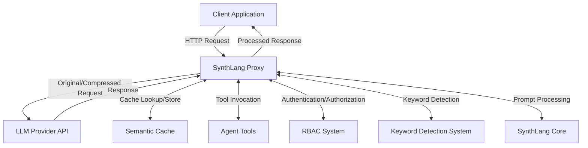
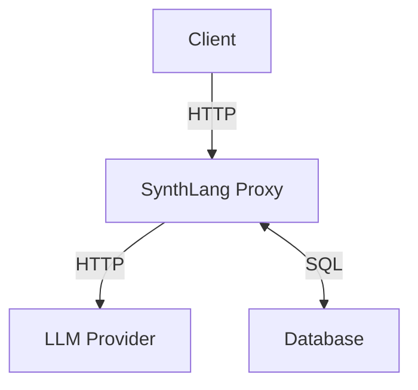
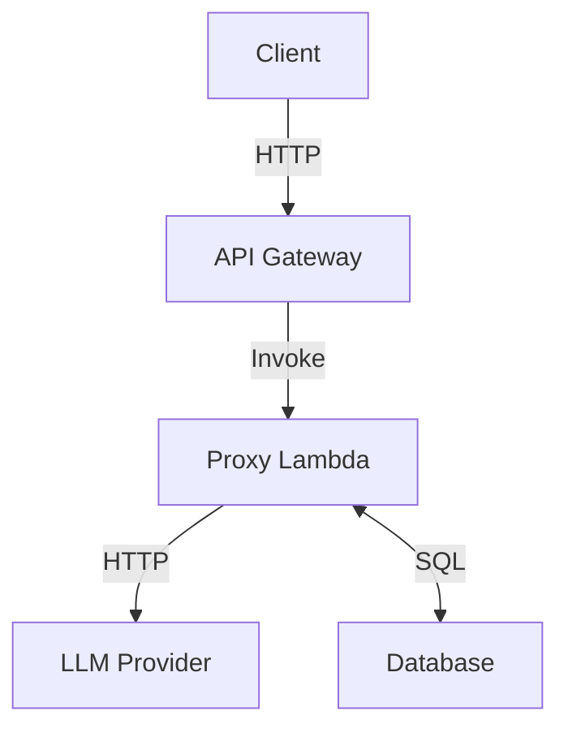
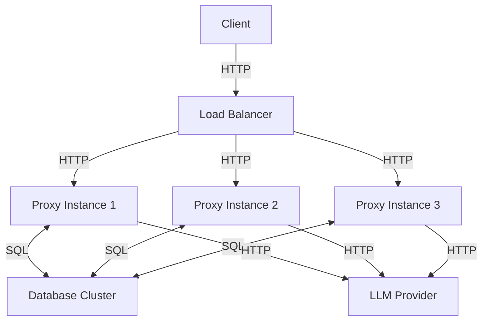

# SynthLang Proxy Architecture

This document provides an overview of the SynthLang Proxy architecture, including its components, design patterns, and architectural principles.

## System Overview

SynthLang Proxy is designed with modularity, extensibility, and performance in mind. It serves as an intelligent middleware layer between client applications and Large Language Model (LLM) providers, enhancing the capabilities of existing applications without requiring modifications to their core logic.

## Core Components

### API Gateway

The API Gateway handles incoming HTTP requests from client applications, providing a compatible interface with OpenAI's API. It includes:

- **Request Validation**: Validates incoming requests against the OpenAI API schema
- **Authentication**: Verifies API keys and establishes user identity
- **Rate Limiting**: Enforces request limits based on user roles
- **Request Routing**: Routes requests to appropriate internal components

### SynthLang Compression

The SynthLang Compression module optimizes token usage through advanced compression techniques:

- **Symbolic Notation**: Converts natural language to compact symbolic representations
- **Semantic Preservation**: Maintains meaning while reducing token count
- **Context Optimization**: Restructures prompts to minimize redundancy
- **GZIP Integration**: Provides additional compression for very large prompts

### Semantic Cache

The Semantic Cache improves response times and reduces costs by caching responses based on semantic similarity:

- **Vector Embedding**: Converts prompts to vector representations
- **Similarity Search**: Identifies semantically similar previous requests
- **Cache Management**: Handles storage, retrieval, and eviction of cache entries
- **Metrics Collection**: Tracks cache performance metrics

### Agent Framework

The Agent Framework enables dynamic, tool-enhanced capabilities:

- **Tool Registry**: Manages registration and discovery of agent tools
- **Tool Execution**: Handles invocation of tools with appropriate parameters
- **Context Management**: Maintains context across tool invocations
- **Error Handling**: Gracefully handles tool execution failures

### Keyword Detection System

The Keyword Detection System automatically identifies patterns in user messages:

- **Pattern Registry**: Stores and manages keyword patterns
- **Pattern Matching**: Identifies matches in user messages
- **Parameter Extraction**: Extracts named parameters from matches
- **Tool Invocation**: Triggers appropriate tools based on matches

### Role-Based Access Control

The RBAC system manages user permissions and access control:

- **Role Management**: Defines and manages user roles and permissions
- **Role Hierarchy**: Implements role inheritance
- **Access Verification**: Enforces access control on protected resources
- **Integration Points**: Connects with tools, endpoints, and keyword patterns

### LLM Provider Integration

The LLM Provider Integration module handles communication with LLM providers:

- **Provider Abstraction**: Provides a unified interface for multiple LLM providers
- **Request Formatting**: Formats requests according to provider specifications
- **Response Processing**: Handles streaming and non-streaming responses
- **Error Handling**: Manages provider-specific error conditions

## Architectural Patterns

### Layered Architecture

SynthLang Proxy follows a layered architecture pattern:

1. **Presentation Layer**: API endpoints and CLI interface
2. **Application Layer**: Business logic, request processing, and feature orchestration
3. **Domain Layer**: Core entities, value objects, and domain services
4. **Infrastructure Layer**: External dependencies, database access, and third-party services

### Middleware Pipeline

Request processing follows a middleware pipeline pattern:

1. **Authentication Middleware**: Verifies API keys and establishes identity
2. **Rate Limiting Middleware**: Enforces request limits
3. **Request Validation Middleware**: Validates request schema
4. **Compression Middleware**: Applies SynthLang compression
5. **Caching Middleware**: Checks for cached responses
6. **Keyword Detection Middleware**: Identifies keyword patterns
7. **LLM Provider Middleware**: Handles provider-specific formatting

### Registry Pattern

The system uses the registry pattern for several components:

- **Tool Registry**: Manages registration and discovery of agent tools
- **Pattern Registry**: Stores and manages keyword patterns
- **Provider Registry**: Manages available LLM providers

### Repository Pattern

Data access follows the repository pattern:

- **Cache Repository**: Abstracts cache storage and retrieval
- **User Repository**: Manages user data and roles
- **Settings Repository**: Handles configuration storage

### Decorator Pattern

The system uses decorators to enhance functionality:

- **Role-Based Decorator**: Restricts access based on user roles
- **Caching Decorator**: Adds caching capabilities to services
- **Logging Decorator**: Adds logging to service methods

## Data Flow

### Request Processing Flow

1. Client application sends a request to the SynthLang Proxy API
2. API Gateway validates the request and authenticates the user
3. Keyword Detection System checks for matching patterns
4. If a pattern matches, the corresponding tool is invoked
5. If no pattern matches or tool execution doesn't generate a complete response:
   a. Semantic Cache checks for similar previous requests
   b. If a cache hit occurs, the cached response is returned
   c. If no cache hit, the request is sent to the LLM Provider
6. Response is processed and returned to the client

### Tool Invocation Flow

1. Tool is identified (via keyword pattern or explicit invocation)
2. Tool parameters are extracted or provided
3. User's role is checked against tool requirements
4. Tool is executed with provided parameters
5. Tool response is incorporated into the overall response

### Caching Flow

1. Incoming request is processed and vectorized
2. Cache is queried with the request vector and similarity threshold
3. If a similar request is found, the cached response is returned
4. If no similar request is found, the response is generated and then cached

## Database Schema

The database stores various data for SynthLang Proxy:

### User Table

| Column       | Type     | Description                |
|--------------|----------|----------------------------|
| id           | UUID     | User ID                    |
| api_key_hash | STRING   | Hashed API key             |
| roles        | ARRAY    | Array of role identifiers  |
| created_at   | DATETIME | Creation timestamp         |
| updated_at   | DATETIME | Last update timestamp      |

### Cache Table

| Column         | Type     | Description                |
|----------------|----------|----------------------------|
| id             | UUID     | Cache entry ID             |
| request_hash   | STRING   | Hash of the request        |
| request_vector | VECTOR   | Vector representation      |
| request        | JSON     | Original request           |
| response       | JSON     | Cached response            |
| created_at     | DATETIME | Creation timestamp         |
| hit_count      | INTEGER  | Number of cache hits       |
| last_hit_at    | DATETIME | Last hit timestamp         |

### Settings Table

| Column       | Type     | Description                |
|--------------|----------|----------------------------|
| key          | STRING   | Setting key                |
| value        | JSON     | Setting value              |
| updated_at   | DATETIME | Last update timestamp      |

## Configuration and Extensibility

SynthLang Proxy is designed for flexibility and extensibility:

### Configuration Options

- **Environment Variables**: Primary configuration method
- **Configuration Files**: Additional structured configuration
- **Dynamic Settings**: Runtime-adjustable configuration

### Extension Points

- **Custom Tools**: Add new agent tools by implementing the tool interface
- **Keyword Patterns**: Define new patterns for automatic tool invocation
- **LLM Providers**: Add support for new LLM providers
- **Compression Methods**: Implement custom compression techniques

## Deployment Architecture

SynthLang Proxy supports various deployment architectures:

### Standalone Deployment

### Serverless Deployment

### High-Availability Deployment

## Performance Considerations

SynthLang Proxy incorporates several performance optimizations:

- **Asynchronous Processing**: Non-blocking I/O for high throughput
- **Connection Pooling**: Efficient database and HTTP connections
- **Minimal Copying**: Avoid unnecessary data copying
- **Streaming Responses**: Stream LLM responses for lower latency
- **Optimized Vector Operations**: Efficient similarity search
- **Tiered Caching**: In-memory and persistent caching

## Security Architecture

Security is a core consideration in the SynthLang Proxy architecture:

- **API Key Authentication**: Secure API key validation
- **Role-Based Access Control**: Fine-grained permission management
- **Encryption**: Sensitive data encryption at rest and in transit
- **PII Protection**: PII detection and masking
- **Input Validation**: Thorough validation of all inputs
- **Audit Logging**: Comprehensive logging of security events
- **Rate Limiting**: Protection against abuse and DoS attacks

## Monitoring and Observability

The system provides comprehensive monitoring capabilities:

- **Metrics Collection**: Performance and usage metrics
- **Structured Logging**: Context-rich, machine-parseable logs
- **Health Checks**: Endpoint for system health verification
- **Cache Statistics**: Detailed cache performance metrics
- **Request Tracing**: End-to-end request tracing