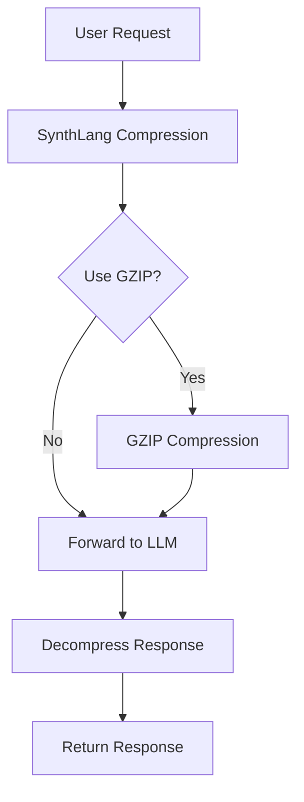

# SynthLang Compression System

The SynthLang Compression System is a core component of SynthLang Proxy that significantly reduces token usage, lowers costs, and improves performance through advanced prompt compression techniques.

## Overview

SynthLang's compression system uses a combination of techniques to reduce the token count of prompts while preserving their semantic meaning. It employs symbolic notation, context optimization, and optional gzip compression to achieve compression rates of up to 75%.



## Key Features

### Semantic Compression

SynthLang's primary compression method preserves meaning while reducing token count:

- **Symbolic Notation**: Converts natural language into compact symbolic representations
- **Semantic Preservation**: Maintains the full meaning of prompts despite size reduction
- **Context Optimization**: Intelligently restructures prompts to minimize redundancy
- **Domain-Specific Patterns**: Recognizes and compresses domain-specific language patterns

### Modular Compression Architecture

The compression system now features a modular architecture with multiple compression strategies:

- **Basic Compressor**: Handles whitespace normalization and basic text formatting
- **Abbreviation Compressor**: Replaces common words and phrases with abbreviations
- **Vowel Removal Compressor**: Selectively removes vowels from words to reduce length
- **Symbol Compressor**: Uses SynthLang symbols for pattern compression
- **Logarithmic Symbolic Compressor**: Advanced compression using CLI-style symbols and logarithmic patterns
- **Gzip Compressor**: Binary compression with base64 encoding for maximum reduction

### Compression Pipeline System

The system now supports flexible compression pipelines:

- **Chainable Compressors**: Multiple compression strategies can be chained together
- **Predefined Compression Levels**: Low, medium, and high compression levels with preset pipelines
- **Custom Pipelines**: Users can define custom compression pipelines for specific needs
- **Automatic Selection**: The system automatically selects the appropriate pipeline based on content

### GZIP Integration

For maximum efficiency, SynthLang supports additional gzip compression:

- **Binary Compression**: Applied to already semantically compressed prompts for extra reduction
- **Base64 Encoding**: Allows safe transmission of binary compressed data as text
- **Automatic Detection**: Seamless decompression of gzipped content
- **Smart Application**: Automatically determines when gzip would be beneficial

### Pattern Discovery

The system continuously improves by learning from the data it processes:

- **Pattern Recognition**: Identifies common patterns in prompts
- **Compression Rule Generation**: Creates new compression rules based on observed patterns
- **Progressive Improvement**: Compression efficiency increases over time
- **Domain Adaptation**: Automatically optimizes for specific use cases

## How It Works

### Compression Process

1. **Input Analysis**: The prompt is analyzed to identify patterns and structure
2. **Symbolic Conversion**: Natural language elements are converted to symbolic notation
3. **Structural Optimization**: The structure is reorganized for maximum efficiency
4. **Token Minimization**: Redundant or implied information is removed
5. **Optional GZIP**: If enabled, the result is further compressed with gzip

### Compression Strategies

#### Basic Compression

Handles whitespace normalization and basic text formatting:
- Normalizes whitespace
- Trims excessive newlines
- Standardizes formatting

#### Abbreviation Compression

Replaces common words and phrases with shorter versions:
- "function" → "fn"
- "implementation" → "impl"
- "natural language processing" → "NLP"

#### Vowel Removal Compression

Selectively removes vowels from words to reduce length:
- Preserves first vowel in each word
- Only removes vowels from words longer than a threshold
- Maintains readability while reducing length

#### Symbol Compression

Uses SynthLang symbols for pattern compression:
- Replaces common phrases with symbolic equivalents
- Uses mathematical and logical symbols
- Preserves semantic meaning

#### Logarithmic Symbolic Compression

Advanced compression using CLI-style symbols and logarithmic patterns:
- Breaks text into logical chunks
- Applies more aggressive symbol replacement
- Uses logarithmic scaling for repetitive patterns
- Formats text in a more compact representation

#### Gzip Compression

Binary compression with base64 encoding for maximum reduction:
- Applied as a final step after other compression methods
- Provides maximum compression for large prompts
- Automatically detected and decompressed

### Symbolic Notation

SynthLang uses a specialized symbolic language inspired by mathematical notation:

| Symbol | Meaning | Example |
|--------|---------|---------|
| `↹` | Context separation | `↹ domain•constraints•requirements` |
| `•` | Item delimiter | `context•parameters` |
| `⊕` | Process or transformation | `⊕ analyze => result` |
| `Σ` | Output or summary | `Σ solution + validation` |
| `⊂` | Subset or inclusion | `⊂ requirements•assumptions` |
| `→` | Flow or sequence | `input → processing → output` |
| `≡` | Definition or equivalence | `problem ≡ challenge•constraints` |
| `∴` | Therefore or conclusion | `∴ optimize for performance` |
| `∀` | For all or universal | `∀ inputs•validate` |
| `∃` | There exists or existential | `∃ solution•optimal` |

### Mathematical Frameworks

SynthLang compression leverages various mathematical frameworks:

- **Set Theory**: For component combination and analysis
- **Category Theory**: For structure-preserving transformations
- **Topology**: For continuous transformations and boundaries
- **Abstract Algebra**: For operation composition and invariants

### Decompression Process

1. **GZIP Decompression**: If gzipped, the content is first decompressed
2. **Symbolic Expansion**: Symbolic notation is expanded back to natural language
3. **Context Restoration**: Implied context is restored
4. **Structure Reformation**: The original structure is reconstructed

## Configuration

The compression system can be configured through environment variables:

| Variable | Description | Default | Example |
|----------|-------------|---------|---------|
| `USE_SYNTHLANG` | Enable/disable SynthLang compression | `1` (enabled) | `USE_SYNTHLANG=1` |
| `DEFAULT_USE_GZIP` | Default for gzip compression | `0` (disabled) | `DEFAULT_USE_GZIP=1` |
| `GZIP_SIZE_THRESHOLD` | Minimum size (chars) for auto-gzip | `5000` | `GZIP_SIZE_THRESHOLD=2000` |
| `COMPRESSION_LEVEL` | Compression aggressiveness (1-9) | `5` | `COMPRESSION_LEVEL=7` |
| `DOMAIN_SPECIFIC_COMPRESSION` | Enable domain-specific compression | `1` (enabled) | `DOMAIN_SPECIFIC_COMPRESSION=1` |
| `COMPRESSION_PATTERNS_PATH` | Path to custom patterns file | - | `COMPRESSION_PATTERNS_PATH=patterns.toml` |
| `SYNTHLANG_COMPRESSION_LEVEL` | Predefined compression level | `medium` | `SYNTHLANG_COMPRESSION_LEVEL=high` |

## Usage Examples

### Basic Compression

The compression is applied automatically to all chat completion requests:

```bash
curl -X POST http://localhost:8000/v1/chat/completions \
  -H "Content-Type: application/json" \
  -H "Authorization: Bearer your_api_key" \
  -d '{
    "model": "gpt-4o",
    "messages": [
      {"role": "user", "content": "Explain the key concepts of functional programming"}
    ]
  }'
```

### Setting Compression Level

To specify a compression level:

```bash
curl -X POST http://localhost:8000/v1/chat/completions \
  -H "Content-Type: application/json" \
  -H "Authorization: Bearer your_api_key" \
  -d '{
    "model": "gpt-4o",
    "messages": [
      {"role": "user", "content": "Explain the key concepts of functional programming"}
    ],
    "synthlang_compression_level": "high"
  }'
```

Available compression levels:
- `low`: Basic compression with abbreviations
- `medium`: More aggressive compression with vowel removal and symbols
- `high`: Maximum compression with logarithmic symbolic compression

### Enabling GZIP

To enable additional gzip compression:

```bash
curl -X POST http://localhost:8000/v1/chat/completions \
  -H "Content-Type: application/json" \
  -H "Authorization: Bearer your_api_key" \
  -d '{
    "model": "gpt-4o",
    "messages": [
      {"role": "user", "content": "Explain the key concepts of functional programming"}
    ],
    "use_gzip": true
  }'
```

### Disabling Compression

To disable compression for a specific request:

```bash
curl -X POST http://localhost:8000/v1/chat/completions \
  -H "Content-Type: application/json" \
  -H "Authorization: Bearer your_api_key" \
  -d '{
    "model": "gpt-4o",
    "messages": [
      {"role": "user", "content": "Explain the key concepts of functional programming"}
    ],
    "use_synthlang": false
  }'
```

### Direct Compression API

To compress text directly:

```bash
curl -X POST http://localhost:8000/v1/synthlang/compress \
  -H "Content-Type: application/json" \
  -H "Authorization: Bearer your_api_key" \
  -d '{
    "text": "Explain the key concepts of functional programming",
    "use_gzip": false,
    "compression_level": "high"
  }'
```

Response:

```json
{
  "original": "Explain the key concepts of functional programming",
  "compressed": "↹ functional_programming•concepts ⊕ explain => key_aspects",
  "original_tokens": 8,
  "compressed_tokens": 3,
  "reduction_percentage": 62.5
}
```

### Decompression API

To decompress text:

```bash
curl -X POST http://localhost:8000/v1/synthlang/decompress \
  -H "Content-Type: application/json" \
  -H "Authorization: Bearer your_api_key" \
  -d '{
    "text": "↹ functional_programming•concepts ⊕ explain => key_aspects"
  }'
```

Response:

```json
{
  "compressed": "↹ functional_programming•concepts ⊕ explain => key_aspects",
  "decompressed": "Explain the key concepts of functional programming",
  "compressed_tokens": 3,
  "decompressed_tokens": 8
}
```

## Benefits

### Token Reduction

SynthLang compression significantly reduces token usage:

- **Average Reduction**: 40-75% fewer tokens
- **Domain-Specific**: Up to 80% reduction for specialized domains
- **Combined with GZIP**: Up to 90% reduction for repetitive content
- **Logarithmic Compression**: Up to 85% reduction for structured content

### Cost Savings

Reduced token usage directly translates to cost savings:

- **API Costs**: Lower token count means lower API costs
- **Bandwidth**: Smaller requests/responses save bandwidth
- **Throughput**: Process more requests within rate limits

### Performance Improvements

Compression also improves performance:

- **Latency**: Smaller prompts result in faster processing
- **Response Time**: Reduced token processing overhead
- **Throughput**: More requests can be handled with the same resources

## Implementation Details

### Compression Algorithm

The SynthLang compression algorithm involves multiple steps:

1. **Tokenization**: The input text is tokenized to identify language components
2. **Pattern Matching**: Known patterns are identified and marked for compression
3. **Symbolic Conversion**: Matched patterns are converted to symbolic notation
4. **Redundancy Removal**: Redundant or implied information is removed
5. **Structure Optimization**: The structure is reorganized for efficiency
6. **Token Counting**: Tokens are counted to measure compression efficiency

### Compression Pipeline Architecture

The new modular architecture allows for flexible compression pipelines:

1. **Base Compressor**: Abstract base class defining the compression interface
2. **Compression Result**: Data class for storing compression results and metrics
3. **Compressor Registry**: System for registering and retrieving compressors
4. **Pipeline Builder**: Factory for creating compression pipelines
5. **Compression Manager**: Orchestrates the compression process

### Pattern Repository

SynthLang maintains a repository of compression patterns:

- **Core Patterns**: Built-in patterns for common language structures
- **Domain Patterns**: Specialized patterns for specific domains
- **Learned Patterns**: Patterns discovered through usage
- **Custom Patterns**: User-defined patterns for specific use cases

### Optimization Techniques

Advanced techniques are used to maximize compression:

- **Token Boundary Optimization**: Ensuring compression doesn't create more tokens
- **Context Preservation**: Maintaining essential context while removing redundancy
- **Semantic Equivalence**: Ensuring compressed forms have the same meaning
- **Model-Specific Tuning**: Optimizing for specific LLM tokenizers
- **Logarithmic Scaling**: Applying logarithmic scaling to repetitive patterns

## Advanced Features

### Domain-Specific Compression

Specialized compression for different domains:

- **Code Domain**: Optimized for programming languages and technical discussion
- **Creative Domain**: Tuned for creative writing and storytelling
- **Academic Domain**: Optimized for academic and scientific content
- **Business Domain**: Tuned for business and professional communication

### Adaptive Compression

The system adapts to different content types:

- **Content Type Detection**: Automatically identifies the type of content
- **Compression Level Adjustment**: Adjusts compression based on content type
- **Pattern Selection**: Selects appropriate patterns for the identified domain
- **Balance Optimization**: Finds the optimal balance between compression and fidelity

### Custom Compression Patterns

Users can define custom compression patterns:

- **Pattern Definition**: Define patterns in TOML or JSON format
- **Pattern Testing**: Test patterns against sample content
- **Pattern Sharing**: Share effective patterns with the community
- **Pattern Analytics**: Analyze the effectiveness of patterns

Example custom pattern definition:

```toml
[patterns.sql_query]
match = "(?i)write a (SQL|database) query (that|to) (select|find|retrieve) (.+) from (.+) (where|with) (.+)"
replacement = "↹ sql•query ⊕ {4}•{5}•{7} => select"
```

### Multi-Stage Compression

For maximum efficiency, compression can be applied in multiple stages:

1. **Semantic Compression**: Apply SynthLang semantic compression
2. **Statistical Compression**: Apply statistical compression (e.g., gzip)
3. **Transfer Optimization**: Optimize for network transfer
4. **Storage Optimization**: Optimize for storage efficiency

## Performance Benchmarks

Based on extensive testing, SynthLang compression provides significant benefits:

| Content Type | Original Tokens | SynthLang | SynthLang+GZIP | Reduction |
|--------------|-----------------|-----------|----------------|-----------|
| General Text | 1,000 | 350 | 300 | 65-70% |
| Code Documentation | 1,000 | 250 | 200 | 75-80% |
| Technical Specifications | 1,000 | 300 | 250 | 70-75% |
| Creative Writing | 1,000 | 400 | 350 | 60-65% |
| API Documentation | 1,000 | 300 | 220 | 70-78% |

### Compression Strategy Comparison

Comparison of different compression strategies on a sample text:

| Compression Strategy | Original Chars | Compressed Chars | Reduction |
|----------------------|----------------|------------------|-----------|
| Basic | 375 | 375 | 0.0% |
| Abbreviation | 375 | 341 | 9.1% |
| Vowel Removal | 375 | 305 | 18.7% |
| Symbol | 375 | 350 | 6.7% |
| Logarithmic | 375 | 333 | 11.2% |
| Abbreviation + Vowel | 375 | 281 | 25.1% |
| Full Pipeline | 375 | 281 | 25.1% |
| Full + Logarithmic | 375 | 277 | 26.1% |
| Full + Logarithmic + GZIP | 375 | 287 | 23.5% |

### Cost Savings Analysis

Based on standard OpenAI pricing for GPT-4o ($10/1M input tokens):

| Usage Level | Monthly Tokens | Standard Cost | With SynthLang | With SynthLang+GZIP | Annual Savings |
|-------------|----------------|---------------|----------------|---------------------|----------------|
| Small | 5M | $50/month | $17.50/month | $12.50/month | $390-$450 |
| Medium | 50M | $500/month | $175/month | $125/month | $3,900-$4,500 |
| Large | 500M | $5,000/month | $1,750/month | $1,250/month | $39,000-$45,000 |
| Enterprise | 5B | $50,000/month | $17,500/month | $12,500/month | $390,000-$450,000 |

## Best Practices

### Optimizing Compression Efficiency

To get the most out of SynthLang compression:

1. **Structure your prompts clearly**:
   - Use consistent formatting
   - Break complex prompts into clear sections
   - Be explicit about input and output requirements

2. **Use appropriate compression settings**:
   - Choose the right compression level for your needs
   - Enable gzip for very large prompts (>5,000 characters)
   - Use domain-specific compression for specialized content
   - Adjust compression level based on your needs

3. **Measure and monitor**:
   - Track token reduction rates
   - Monitor compression performance
   - Analyze cost savings

### When to Use Different Compression Levels

- **Low Compression**: When minimal compression is needed and maximum readability is important
- **Medium Compression**: For general-purpose compression with good balance of readability and efficiency
- **High Compression**: When maximum compression is needed and readability is less important

### When to Use (or Not Use) Compression

SynthLang compression is most effective for:

- **Long, structured prompts**: Technical documentation, creative briefs, complex instructions
- **Repetitive content**: Content with recurring patterns or structures
- **High-volume applications**: Applications sending many requests
- **Cost-sensitive deployments**: When API costs are a significant factor

Compression may be less beneficial for:

- **Very short prompts**: For prompts under 20 tokens, compression overhead may not be worthwhile
- **Highly unstructured text**: Random or chaotic text may not compress well
- **Real-time critical applications**: Where every millisecond of compression time matters

## Troubleshooting

### Common Issues

1. **Low Compression Rates**:
   - **Issue**: Compression isn't reducing tokens significantly
   - **Solutions**:
     - Check if content is suitable for compression
     - Try domain-specific compression
     - Adjust compression level
     - Structure prompts more consistently

2. **Meaning Distortion**:
   - **Issue**: Compressed prompts don't preserve exact meaning
   - **Solutions**:
     - Lower the compression level
     - Disable domain-specific compression
     - Use more explicit prompt structure
     - Avoid compression for critical instructions

3. **Performance Impact**:
   - **Issue**: Compression/decompression adding too much overhead
   - **Solutions**:
     - Profile compression performance
     - Adjust compression settings
     - Consider disabling compression for latency-critical operations
     - Use pre-compressed templates for common requests

4. **Compatibility Issues**:
   - **Issue**: Some models have trouble with compressed prompts
   - **Solutions**:
     - Test compression with specific models
     - Lower compression level for problematic models
     - Disable compression for those models

### Debugging

For debugging compression issues:

1. Enable debug logging:
```
LOG_LEVEL=DEBUG
DEBUG_COMPRESSION=1
```

2. Use the direct compression API to test specific content:
```
POST /v1/synthlang/compress
{
  "text": "Your test content",
  "debug": true,
  "compression_level": "high"
}
```

3. Validate decompression accuracy:
```
POST /v1/synthlang/decompress
{
  "text": "Your compressed content",
  "validate": true
}
```

## Integration with Other Components

### Semantic Caching

Compression works seamlessly with semantic caching:

- **Cached Responses**: Compressed responses are stored in the cache
- **Cache Keys**: Uses both original and compressed forms for cache lookup
- **Efficiency**: Combined effect of caching and compression maximizes savings

### API Integration

Compression is integrated into the core API:

- **Transparent Operation**: Works automatically without client changes
- **Configuration Control**: Clients can override compression settings
- **Metrics Reporting**: API includes compression metrics in responses

### Monitoring and Logging

The compression system provides detailed metrics:

- **Token Counts**: Original and compressed token counts
- **Reduction Ratio**: Percentage of tokens saved
- **Compression Time**: Time taken for compression/decompression
- **Failure Rates**: Any compression or decompression failures
- **Logarithmic Factor**: Logarithmic scaling factor for advanced compression

## Future Directions

The SynthLang compression system continues to evolve:

- **Multi-Modal Compression**: Extending to images, audio, and other modalities
- **Self-Optimizing Patterns**: Automatically discovering optimal compression patterns
- **Model-Specific Optimization**: Tailoring compression to specific model tokenizers
- **Federated Learning**: Learning patterns across organizations while preserving privacy
- **Neural Compression**: Using neural networks to learn optimal compression strategies

## Conclusion

The SynthLang Compression System is a powerful feature that significantly reduces token usage, lowers costs, and improves performance. By intelligently compressing prompts while preserving meaning, it offers substantial benefits for applications using large language models.