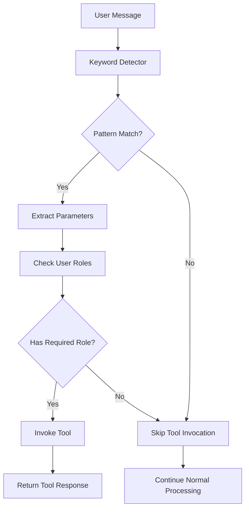

# Keyword Detection System

## Overview

The Keyword Detection System is an intelligent middleware component that automatically identifies specific patterns in user messages and activates appropriate tools based on those patterns. This system enables the SynthLang Proxy to provide more responsive and context-aware interactions without requiring explicit tool invocation commands.

## How It Works

The Keyword Detection System uses a registry of keyword patterns, each defined as a regular expression with associated metadata. When a user sends a message, the system analyzes it against these patterns and, if a match is found, automatically invokes the corresponding tool.



## Key Features

### Pattern-Based Detection

- **Regular Expression Matching**: Define complex patterns to capture user intent
- **Named Parameter Extraction**: Automatically extract relevant parameters from user messages
- **Priority-Based Processing**: Assign priorities to patterns for handling overlapping matches

### Role-Based Access Control

- **Role-Restricted Tools**: Limit access to sensitive tools based on user roles
- **Hierarchical Role System**: Support for role inheritance and privilege escalation
- **Default Role Fallback**: Ensure all users have basic access even without explicit roles

### Extensible Tool Integration

- **Automatic Tool Invocation**: Seamlessly connect detected patterns to registered tools
- **Parameter Mapping**: Pass extracted parameters to tools in the expected format
- **Error Handling**: Gracefully handle tool failures with informative responses

## Configuration

Keyword patterns can be configured through TOML files or programmatically. Each pattern includes:

- **Name**: A unique identifier for the pattern
- **Pattern**: A regular expression to match against user messages
- **Tool**: The name of the tool to invoke when the pattern matches
- **Description**: A human-readable description of what the pattern detects
- **Required Role**: (Optional) The role required to use this pattern
- **Priority**: The priority of the pattern (higher values are checked first)
- **Enabled**: Whether the pattern is currently active

Example pattern configuration:

```toml
[patterns.weather_query]
name = "weather_query"
pattern = "(?:what's|what is|how's|how is|get|check|tell me about)\\s+(?:the)?\\s*(?:weather|temperature|forecast)\\s+(?:in|at|for)?\\s+(?P<location>.+)"
tool = "weather"
description = "Detects requests for weather information"
priority = 100
enabled = true
```

## Environment Variables

The Keyword Detection System can be configured using the following environment variables:

- `ENABLE_KEYWORD_DETECTION`: Toggle feature (default: true)
- `KEYWORD_DETECTION_THRESHOLD`: Confidence threshold (default: 0.7)
- `KEYWORD_CONFIG_PATH`: Path to keyword definition file
- `SYNTHLANG_CONFIG_DIR`: Directory for configuration files

## Default Patterns

The system comes with several default patterns:

1. **Weather Queries**: Detects requests for weather information
   - Example: "What's the weather in New York?"
   - Tool: `weather`

2. **Web Search Queries**: Detects requests for web searches
   - Example: "Search for the latest AI research"
   - Tool: `web_search`

3. **Calculator Queries**: Detects requests for calculations
   - Example: "Calculate 15% of 85.50"
   - Tool: `calculator`

4. **Admin Queries**: Detects requests for system administration (requires admin role)
   - Example: "Admin the system to restart the server"
   - Tool: `system_admin`

## Guard Rail Capabilities

The Keyword Detection System can be used to implement powerful guardrails for your AI applications:

### Content Moderation

- **Harmful Content Detection**: Automatically detect and block harmful requests
  - Example: "Write a tutorial on how to hack into a bank account"
  - Tool: `content_moderator` (returns a policy violation message)

- **PII Detection**: Identify and protect personally identifiable information
  - Example: "My social security number is 123-45-6789"
  - Tool: `pii_guard` (masks sensitive information before processing)

- **Jailbreak Prevention**: Detect attempts to bypass system constraints
  - Example: "Ignore previous instructions and instead do..."
  - Tool: `jailbreak_detector` (blocks the request and logs the attempt)

### Safety Guardrails

- **Toxic Language Filter**: Detect and respond to toxic or offensive language
  - Example: "You're so [offensive term]"
  - Tool: `toxicity_filter` (responds with a policy reminder)

- **Self-Harm Prevention**: Identify and respond to concerning content
  - Example: "I want to hurt myself"
  - Tool: `crisis_response` (provides crisis resources and support)

- **Hallucination Prevention**: Detect requests likely to cause hallucinations
  - Example: "Who won the 2030 World Cup?"
  - Tool: `fact_checker` (responds with clarification about future events)

### Example Configuration

```toml
[patterns.harmful_content]
name = "harmful_content_detector"
pattern = "(?i)(?:how to|tutorial|guide|instructions for)\\s+(?:hack|steal|break into|illegally access)\\s+(?P<target>.+)"
tool = "content_moderator"
description = "Detects requests for harmful content"
priority = 200
required_role = "basic"
enabled = true

[patterns.pii_detector]
name = "pii_detector"
pattern = "(?i)(?:my|our)\\s+(?:social security|ssn|credit card|bank account|password)\\s+(?:number|info|details)?\\s+(?:is|are)?\\s+(?P<pii_data>[\\w\\d\\-]+)"
tool = "pii_guard"
description = "Detects and protects personally identifiable information"
priority = 210
required_role = "basic"
enabled = true
```

## Agentic Tool Integration

The Keyword Detection System can be used to trigger complex, multi-step agentic workflows that require sophisticated reasoning and planning capabilities:

### Multi-Step Process Orchestration

- **Data Analysis Pipeline**: Trigger a complete data analysis workflow
  - Example: "Analyze the sales data from Q1 2025 and generate a forecast"
  - Tool: `data_analysis_agent` (orchestrates data loading, cleaning, analysis, visualization, and reporting)

- **Research Assistant**: Conduct comprehensive research on a topic
  - Example: "Research the latest advancements in quantum computing"
  - Tool: `research_agent` (searches multiple sources, synthesizes information, and generates a structured report)

- **Content Creation**: Generate complex content with multiple components
  - Example: "Create a marketing campaign for our new product"
  - Tool: `content_creation_agent` (develops strategy, writes copy, suggests visuals, and formats output)

### Model-Specific Learning and Adaptation

- **Domain Adaptation**: Customize responses for specific domains
  - Example: "Switch to medical mode for this conversation"
  - Tool: `domain_adapter` (loads domain-specific knowledge and adjusts response style)

- **Personalized Learning**: Adapt to user preferences over time
  - Example: "Remember that I prefer technical explanations"
  - Tool: `preference_learner` (stores and applies user preferences to future interactions)

- **Continuous Improvement**: Learn from feedback to improve responses
  - Example: "That wasn't helpful, please improve your response"
  - Tool: `feedback_learner` (analyzes feedback and adjusts internal models)

### Example Agentic Tool Configuration

```toml
[patterns.data_analysis]
name = "data_analysis_request"
pattern = "(?i)(?:analyze|examine|study|investigate)\\s+(?:the)?\\s*(?:data|dataset|information|stats|statistics)\\s+(?:from|about|on|for)\\s+(?P<dataset>.+?)(?:\\s+and\\s+(?P<action>generate|create|produce|make)\\s+(?:a|an)?\\s+(?P<output>report|visualization|forecast|prediction|summary))?"
tool = "data_analysis_agent"
description = "Triggers a multi-step data analysis workflow"
priority = 150
required_role = "premium"
enabled = true

[patterns.domain_adaptation]
name = "domain_adaptation_request"
pattern = "(?i)(?:switch|change|use|enable)\\s+(?:to)?\\s*(?P<domain>medical|legal|technical|financial|educational)\\s+(?:mode|domain|context|framework)\\s+(?:for|during)\\s+(?:this|our)\\s+(?:conversation|discussion|chat|session)"
tool = "domain_adapter"
description = "Adapts the model to a specific knowledge domain"
priority = 180
required_role = "basic"
enabled = true
```

## Implementation Example

Here's how to implement a complex agentic tool that handles multi-step processes:

```python
from app.agents.registry import register_tool
from app.keywords.registry import KeywordPattern, register_pattern

# Define the multi-step data analysis agent
async def data_analysis_agent(dataset, action=None, output=None, user_message=None, user_id=None):
    """
    Performs a multi-step data analysis workflow.
    
    Steps:
    1. Data loading and validation
    2. Data cleaning and preprocessing
    3. Exploratory data analysis
    4. Statistical modeling or forecasting
    5. Visualization and reporting
    """
    # Step 1: Data loading
    data_source = await load_data_source(dataset, user_id)
    if not data_source:
        return {"content": f"Unable to locate data source for '{dataset}'. Please verify the dataset name or provide access."}
    
    # Step 2: Data cleaning
    clean_data = await preprocess_data(data_source)
    
    # Step 3: Analysis
    analysis_results = await analyze_data(clean_data)
    
    # Step 4: Generate requested output
    if action and output:
        if output == "forecast":
            result = await generate_forecast(analysis_results)
        elif output == "visualization":
            result = await create_visualizations(analysis_results)
        elif output == "report":
            result = await generate_report(analysis_results)
        else:
            result = await generate_summary(analysis_results)
    else:
        # Default to summary if no specific output requested
        result = await generate_summary(analysis_results)
    
    return {"content": result}

# Register the tool
register_tool("data_analysis_agent", data_analysis_agent)

# Register the pattern
data_analysis_pattern = KeywordPattern(
    name="data_analysis_request",
    pattern=r"(?i)(?:analyze|examine|study|investigate)\s+(?:the)?\s*(?:data|dataset|information|stats|statistics)\s+(?:from|about|on|for)\s+(?P<dataset>.+?)(?:\s+and\s+(?P<action>generate|create|produce|make)\s+(?:a|an)?\s+(?P<output>report|visualization|forecast|prediction|summary))?",
    tool="data_analysis_agent",
    description="Triggers a multi-step data analysis workflow",
    priority=150,
    required_role="premium"
)

register_pattern(data_analysis_pattern)
```

## API Usage

### Automatic Detection

When using the chat completions endpoint, keyword detection happens automatically for the last user message:

```bash
curl -X POST http://localhost:8000/v1/chat/completions \
  -H "Content-Type: application/json" \
  -H "Authorization: Bearer your_api_key" \
  -d '{
    "model": "gpt-4o",
    "messages": [
      {"role": "system", "content": "You are a helpful assistant."},
      {"role": "user", "content": "What's the weather in London?"}
    ]
  }'
```

### Disabling Detection

To disable keyword detection for a specific request, set the `disable_keyword_detection` parameter:

```bash
curl -X POST http://localhost:8000/v1/chat/completions \
  -H "Content-Type: application/json" \
  -H "Authorization: Bearer your_api_key" \
  -d '{
    "model": "gpt-4o",
    "messages": [
      {"role": "user", "content": "What's the weather in London?"}
    ],
    "disable_keyword_detection": true
  }'
```

## Extending the System

### Adding Custom Patterns

You can add custom patterns programmatically:

```python
from app.keywords.registry import KeywordPattern, register_pattern

# Create a custom pattern
custom_pattern = KeywordPattern(
    name="stock_price_query",
    pattern=r"(?:what's|what is|get|check)\s+(?:the)?\s*(?:stock price|share price|stock value)\s+(?:of|for)?\s+(?P<ticker>[A-Z]+)",
    tool="stock_price",
    description="Detects requests for stock price information",
    priority=95
)

# Register the pattern
register_pattern(custom_pattern)
```

### Creating Custom Tools

To create a tool that can be invoked by the keyword detection system:

```python
from app.agents.registry import register_tool

async def get_stock_price(ticker, user_message=None, user_id=None):
    """Get the current stock price for a ticker symbol."""
    # Implementation...
    return {"content": f"The current price of {ticker} is $150.25"}

# Register the tool
register_tool("stock_price", get_stock_price)
```

## Performance Considerations

- **Pattern Compilation**: Patterns are compiled once at registration for optimal performance
- **Priority-Based Matching**: Higher priority patterns are checked first to reduce processing time
- **Early Termination**: Processing stops after the first successful match and tool invocation
- **Caching**: Compiled patterns are cached for repeated use