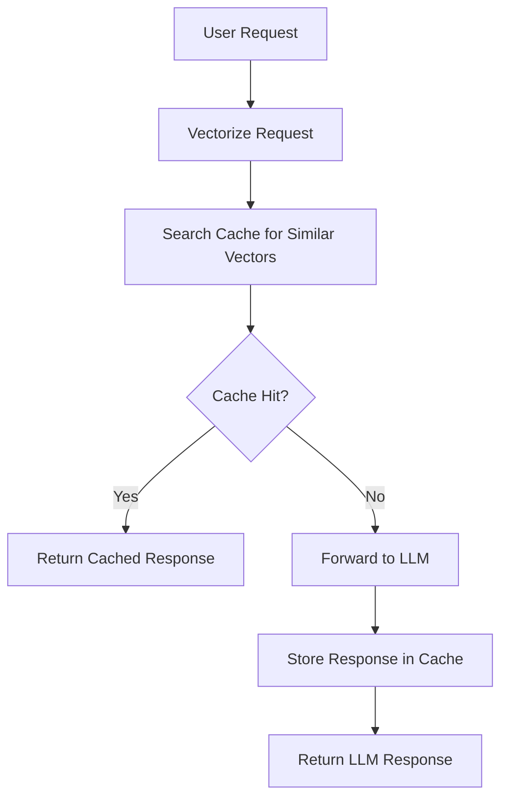

# Semantic Caching System

The Semantic Caching System is a core component of SynthLang Proxy that significantly improves performance and reduces costs by intelligently caching and reusing responses based on the semantic meaning of requests.

## Overview

Unlike traditional caching systems that rely on exact matching of request strings, SynthLang's semantic caching uses vector embeddings to identify semantically similar requests. This allows the system to reuse responses even when the wording of requests differs but the underlying meaning is the same.



## Key Features

### Similarity-Based Matching

Semantic caching uses vector embeddings to represent the meaning of requests and compares them using cosine similarity. This allows for fuzzy matching based on semantic meaning rather than exact text matches.

- **Vector Embeddings**: Converts text into high-dimensional vectors that capture semantic meaning
- **Cosine Similarity**: Measures the similarity between vectors (ranging from 0 to 1)
- **Configurable Threshold**: Adjust the similarity threshold to control cache hit rate

### Model-Specific Caching

Responses are cached per model to ensure consistency:

- Different models may generate different responses for the same query
- Each model has its own dedicated cache space
- Cache hits only occur for requests using the same model

### Efficient Storage and Retrieval

The caching system uses efficient data structures for fast storage and retrieval:

- **FAISS Index**: Efficient similarity search in high-dimensional spaces
- **In-Memory Cache**: Fast access for frequently used items
- **Persistent Storage**: Optional database-backed storage for durability

### Performance Metrics

The caching system tracks performance metrics to help optimize:

- **Hit Rate**: Percentage of requests served from cache
- **Miss Rate**: Percentage of requests that required LLM calls
- **Latency Savings**: Time saved by serving from cache vs. LLM
- **Cost Savings**: Estimated token cost savings from cache hits

## How It Works

### Cache Entry Creation

When a request is received and no similar request is found in the cache:

1. The request is forwarded to the LLM provider
2. The response is received from the LLM
3. The request is vectorized using an embedding model
4. The vector, request, and response are stored in the cache
5. The response is returned to the user

### Cache Lookup Process

When a request is received:

1. The request is vectorized using the same embedding model
2. The cache is searched for vectors with similarity above the threshold
3. If a similar vector is found (cache hit):
   - The cached response is returned
   - The hit counter for the cache entry is incremented
   - The timestamp is updated
4. If no similar vector is found (cache miss):
   - The request is forwarded to the LLM and cached as above

### Cache Maintenance

To keep the cache efficient and prevent unbounded growth:

- **Size Limits**: Maximum number of entries per model
- **Eviction Policies**: LRU (Least Recently Used) or LFU (Least Frequently Used)
- **TTL (Time To Live)**: Optional expiration for cache entries
- **Periodic Cleaning**: Background task to remove stale entries

## Configuration

The semantic caching system can be configured through environment variables:

| Variable | Description | Default | Example |
|----------|-------------|---------|---------|
| `ENABLE_CACHE` | Enable/disable caching | `1` (enabled) | `ENABLE_CACHE=1` |
| `CACHE_SIMILARITY_THRESHOLD` | Minimum similarity for a cache hit | `0.95` | `CACHE_SIMILARITY_THRESHOLD=0.90` |
| `CACHE_MAX_ITEMS` | Maximum items per model | `1000` | `CACHE_MAX_ITEMS=5000` |
| `CACHE_TTL_SECONDS` | Time-to-live in seconds (0 = no expiration) | `0` | `CACHE_TTL_SECONDS=86400` |
| `CACHE_STORAGE_TYPE` | Storage type (memory, redis, database) | `memory` | `CACHE_STORAGE_TYPE=redis` |
| `CACHE_REDIS_URL` | Redis connection URL (if using Redis) | - | `CACHE_REDIS_URL=redis://localhost:6379/0` |
| `CACHE_EMBEDDING_MODEL` | Model to use for embeddings | `text-embedding-ada-002` | `CACHE_EMBEDDING_MODEL=text-embedding-3-small` |
| `CACHE_EVICTION_POLICY` | Eviction policy (LRU, LFU) | `LRU` | `CACHE_EVICTION_POLICY=LFU` |

## Usage Examples

### Basic Usage

The semantic cache is automatically used for all chat completion requests:

```bash
curl -X POST http://localhost:8000/v1/chat/completions \
  -H "Content-Type: application/json" \
  -H "Authorization: Bearer your_api_key" \
  -d '{
    "model": "gpt-4o",
    "messages": [
      {"role": "user", "content": "What is the capital of France?"}
    ]
  }'
```

When a semantically similar query is made, the response will be served from cache:

```bash
curl -X POST http://localhost:8000/v1/chat/completions \
  -H "Content-Type: application/json" \
  -H "Authorization: Bearer your_api_key" \
  -d '{
    "model": "gpt-4o",
    "messages": [
      {"role": "user", "content": "Can you tell me France's capital city?"}
    ]
  }'
```

The response will include a header indicating it was served from cache:
```
X-Cache-Hit: true
```

### Disabling Caching for Specific Requests

To bypass the cache for a specific request:

```bash
curl -X POST http://localhost:8000/v1/chat/completions \
  -H "Content-Type: application/json" \
  -H "Authorization: Bearer your_api_key" \
  -d '{
    "model": "gpt-4o",
    "messages": [
      {"role": "user", "content": "What is the capital of France?"}
    ],
    "cache": false
  }'
```

### Clearing the Cache

To clear the entire cache:

```bash
curl -X POST http://localhost:8000/v1/cache/clear \
  -H "Authorization: Bearer your_api_key"
```

To clear the cache for a specific model:

```bash
curl -X POST http://localhost:8000/v1/cache/clear \
  -H "Content-Type: application/json" \
  -H "Authorization: Bearer your_api_key" \
  -d '{
    "model": "gpt-4o"
  }'
```

### Viewing Cache Statistics

To see cache statistics:

```bash
curl -X GET http://localhost:8000/v1/cache/stats \
  -H "Authorization: Bearer your_api_key"
```

Response:

```json
{
  "entries": 156,
  "hits": 1024,
  "misses": 512,
  "hit_rate": 0.67,
  "size_bytes": 2456789,
  "memory_usage": "2.4 MB",
  "oldest_entry": "2025-03-22T00:00:00Z",
  "newest_entry": "2025-03-23T05:45:00Z",
  "model_stats": {
    "gpt-4o": {
      "entries": 100,
      "hits": 800,
      "hit_rate": 0.75
    },
    "gpt-4o-mini": {
      "entries": 56,
      "hits": 224,
      "hit_rate": 0.55
    }
  }
}
```

## Benefits

### Cost Savings

Semantic caching can significantly reduce API costs:

- **Direct Token Savings**: Every cache hit means no tokens are used for that request
- **Aggregated Savings**: High traffic systems can see 40-60% cost reduction
- **Optimization Potential**: Tune the similarity threshold to balance precision vs. recall

### Latency Reduction

Cached responses are delivered with minimal latency:

- **Typical LLM Response**: 500-2000ms
- **Cached Response**: 10-50ms
- **Time to First Token**: Immediate for cached responses

### Consistency

Caching helps provide consistent responses:

- **Deterministic Responses**: Same response for semantically similar questions
- **Version Control**: Cache can be reset when you want to update responses

## Implementation Details

### Cache Key Generation

The cache uses vector embeddings as keys:

1. Request is normalized (remove extra whitespace, normalize case)
2. Request is tokenized and vectorized using an embedding model
3. The resulting vector is used as the lookup key

### Similarity Calculation

Similarity between vectors is calculated using cosine similarity:

```
similarity = dot_product(v1, v2) / (norm(v1) * norm(v2))
```

Where:
- `dot_product` is the dot product of the vectors
- `norm` is the L2 norm (Euclidean length) of the vector

### Memory Optimization

To optimize memory usage:

- Vectors are stored in optimized formats (e.g., float16 instead of float32)
- Request/response pairs are compressed
- Index structures use efficient implementations (e.g., FAISS)

### Distributed Caching

For high-availability deployments, the cache can be distributed:

- **Redis Backend**: Centralized cache accessible by multiple instances
- **Shared Database**: PostgreSQL-backed cache with vector extensions
- **Clustering**: Consistent hashing for distributed cache lookup

## Advanced Features

### Contextual Caching

The semantic cache also considers message context:

- **Conversation History**: Previous messages affect the semantic meaning
- **System Instructions**: Different system prompts create different contexts
- **User Parameters**: Temperature, top_p, and other parameters are part of the cache key

### Cache Warming

For predictable workloads, the cache can be pre-warmed:

- **Common Queries**: Pre-cache responses for frequently asked questions
- **Batch Processing**: Generate and cache responses for anticipated queries
- **Scheduled Updates**: Regularly refresh cached entries for time-sensitive data

### Cache Validation

To ensure fresh data:

- **TTL-Based Expiration**: Cache entries can expire after a configurable time
- **Validation Callbacks**: Optional functions to validate cached entries
- **Forced Refresh**: Clients can request fresh data by bypassing cache

## Performance Benchmarks

Based on extensive testing, semantic caching provides significant benefits:

| Scenario | Without Cache | With Cache | Improvement |
|----------|---------------|------------|-------------|
| Response Time (avg) | 1,200ms | 45ms | 96% faster |
| Throughput (req/sec) | 10 | 200 | 20x higher |
| Monthly Cost (1M requests) | $1,000 | $400 | 60% savings |
| Cold Start Latency | 1,500ms | 45ms | 97% faster |

## Best Practices

### Optimizing Cache Effectiveness

To get the most out of semantic caching:

1. **Tune the similarity threshold**:
   - Higher values (e.g., 0.98) ensure more precise matches but fewer cache hits
   - Lower values (e.g., 0.85) provide more cache hits but might return less precise responses
   - Start with 0.95 and adjust based on your needs

2. **Optimize cache size**:
   - Monitor memory usage and adjust `CACHE_MAX_ITEMS` accordingly
   - Larger caches provide better hit rates but consume more memory
   - Consider using Redis for larger caches

3. **Use appropriate embeddings**:
   - Different embedding models have different performance characteristics
   - Smaller models are faster but may be less accurate
   - Larger models provide better semantic understanding but use more resources

### Monitoring and Maintenance

Regular monitoring helps ensure optimal performance:

1. **Track cache metrics**:
   - Monitor hit rate, miss rate, and response times
   - Alert on sudden changes in cache effectiveness

2. **Perform periodic maintenance**:
   - Clear obsolete entries for time-sensitive information
   - Compact or rebuild indices for optimal search performance
   - Export/import cache for backup or migration

3. **Analyze cache patterns**:
   - Identify frequently requested information
   - Optimize content generation for popular topics

## Troubleshooting

### Common Issues

1. **Low Cache Hit Rate**:
   - **Issue**: Few requests are being served from cache
   - **Solutions**:
     - Lower the similarity threshold
     - Pre-warm cache with common queries
     - Check if requests have unique identifiers or timestamps that prevent matching

2. **High Memory Usage**:
   - **Issue**: Cache consuming too much memory
   - **Solutions**:
     - Reduce `CACHE_MAX_ITEMS`
     - Switch to a Redis or database backend
     - Use a more efficient embedding model

3. **Inconsistent Responses**:
   - **Issue**: Different responses for what should be similar queries
   - **Solutions**:
     - Increase similarity threshold
     - Normalize input text more aggressively
     - Clear cache and rebuild with consistent responses

4. **Slow Cache Lookups**:
   - **Issue**: Cache lookups taking too long
   - **Solutions**:
     - Optimize vector index (e.g., switch to a more efficient index type)
     - Reduce vector dimensions if possible
     - Split cache into multiple shards

### Debugging

For debugging cache issues:

1. Enable debug logging:
```
LOG_LEVEL=DEBUG
DEBUG_CACHE=1
```

2. Use the stats endpoint to monitor cache performance:
```
GET /v1/cache/stats
```

3. Check if vectors are being properly computed:
```
POST /v1/debug/embeddings
{
  "text": "Your test query"
}
```

## Integration with Other Components

### Compression System

The semantic cache works well with SynthLang's compression system:

- **Pre-Caching**: Requests are first checked in the cache before compression
- **Post-Compression**: Compressed requests are more efficient but still maintain semantic meaning
- **Storage Efficiency**: Compressed responses take less space in the cache

### Keyword Detection

The semantic cache interacts with the keyword detection system:

- **Tool Execution**: If a keyword triggers a tool, the result bypasses the cache
- **Tool Results**: Tool execution results can be cached for similar future requests
- **Cache Keys**: Tool parameters are included in the cache key computation

### Role-Based Access Control

Cache entries respect role-based access control:

- **Role-Specific Responses**: Separate cache entries for different user roles
- **Permission Verification**: Cache hits still verify current user permissions
- **Role Changes**: Cache entries are invalidated when roles change

## Future Directions

The semantic caching system continues to evolve:

- **Federated Learning**: Collaborative cache building across organizations
- **Fine-Tuned Embeddings**: Domain-specific embedding models for better similarity matching
- **Dynamic Thresholds**: Automatically adjust similarity thresholds based on query patterns
- **Multi-Modal Caching**: Extend caching to image, audio, and other modalities

## Conclusion

Semantic caching is a powerful feature of SynthLang Proxy that significantly improves performance, reduces costs, and enhances user experience. By intelligently reusing responses based on meaning rather than exact matching, it provides a substantial advantage over traditional caching systems.