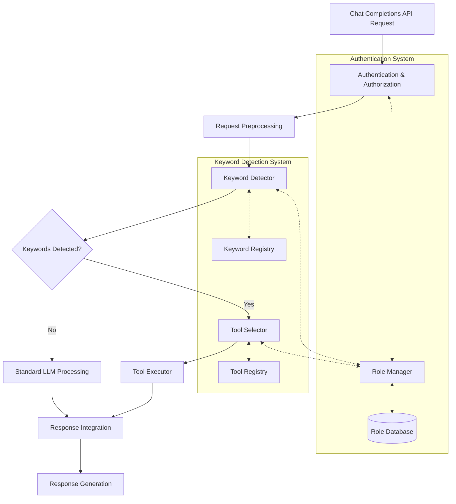

# Keyword Detection System with Role-Based Access Control

## Overview

This document outlines the implementation plan for adding two key features to the SynthLang Proxy:
1. A keyword detection system that automatically identifies and activates appropriate tools based on user messages
2. An enhanced authentication system with role-based access control

This implementation will follow Test-Driven Development (TDD) principles, focusing on one component at a time, with thorough testing and refinement at each step.

## System Architecture

## Implementation Steps

### Phase 1: Enhanced Authentication System with Role-Based Access Control

1. **Role Management Schema**
   - Define role hierarchy model
   - Extend user model to support multiple roles
   - Create default roles for new users

2. **Role-Based Authorization**
   - Implement role validation functions
   - Add role validation to existing authentication flow
   - Create function decorators for role-restricted endpoints

3. **Testing Role-Based Access**
   - Unit tests for role validation
   - Integration tests for role-based access control

### Phase 2: Keyword Detection System

1. **Keyword Registry**
   - Design keyword pattern model
   - Implement registry for storing patterns
   - Create efficient pattern matching mechanism

2. **Detection Middleware**
   - Implement middleware for message analysis
   - Create integration with chat completions endpoint
   - Add performance monitoring for detection

3. **Tool Integration**
   - Connect keyword detection to tool registry
   - Implement parameter extraction from patterns
   - Create role-based tool access controls

4. **Testing Keyword Detection**
   - Unit tests for pattern matching
   - Integration tests for end-to-end detection
   - Performance tests for optimization

### Phase 3: API Enhancements

1. **CORS Implementation**
   - Add configurable CORS support
   - Implement CORS middleware
   - Create origin validation system

2. **Configuration and Optimization**
   - Add environment variables for configuration
   - Implement caching for pattern compilation
   - Optimize detection algorithms for speed

## Detailed Implementation Plan

### Step 1: Extend Authentication with Role Support

1. Update `auth.py` to include role management functions:
   - `get_user_roles(user_id)`
   - `has_role(user_id, role)`
   - `add_user_role(user_id, role)`
   - `remove_user_role(user_id, role)`

2. Create tests for role management functions

3. Update configuration to support role definitions

### Step 2: Create Keyword Pattern Model

1. Create `keywords.py` module with:
   - `KeywordPattern` class for pattern definition
   - `KeywordRegistry` for storing and retrieving patterns
   - Pattern matching and parameter extraction functions

2. Create tests for keyword pattern matching

3. Implement efficient pattern compilation and caching

### Step 3: Implement Detection Middleware

1. Create middleware for processing messages:
   - Analyze user messages for keyword patterns
   - Extract parameters from matched patterns
   - Select and execute appropriate tools

2. Integrate with chat completions endpoint

3. Create tests for middleware functionality

### Step 4: Add CORS Support

1. Implement CORS middleware
   - Add configurable allowed origins
   - Add proper CORS headers to responses

2. Create tests for CORS functionality

### Step 5: Optimize and Finalize

1. Implement performance optimizations:
   - Caching for compiled patterns
   - Early termination for pattern matching
   - Prioritization of patterns

2. Add comprehensive logging and monitoring

3. Create final integration tests

## Configuration Options

New environment variables will include:
- `ENABLE_KEYWORD_DETECTION`: Toggle feature (default: true)
- `KEYWORD_DETECTION_THRESHOLD`: Confidence threshold (default: 0.7)
- `KEYWORD_CONFIG_PATH`: Path to keyword definition file
- `ENABLE_CORS`: Toggle CORS support (default: false)
- `CORS_ALLOWED_ORIGINS`: Comma-separated list of allowed origins

## Testing Strategy

For each component:
1. Write unit tests first
2. Implement the minimal code to pass tests
3. Refactor for optimization and clarity
4. Add integration tests
5. Verify performance under load

## Security Considerations

- Input validation for all patterns
- Rate limiting for pattern matching
- Role validation auditing
- Prevention of regex-based attacks